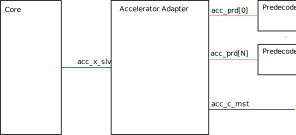
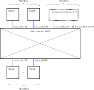

# RISC-V Extension Interface

The RISC-V Extension Interface (REI) defines a unified framework for RISC-V CPU cores to implement ISA extensions in external functional units and to share accelerator- and co-processor structures among multiple cores.

**Warning:** This draft specification is under development.
Changes may occur at any time.

This documentation does not yet include enforcement of the RISC-V memory consistency model and physical memory protection and attributes.
Possible proposals to implement those features are discussed [here](open-questions.md).

## Background
The different RISC-V cores originally designed and used at IIS (CV32E40P, CVA6, Ibex, Snitch) all feature various, and configurable extensions over the baseline RV32I/RV64I ISA.
Examples include support for the custom Xpulp ISA extensions, standard extensions like B (Bitmanip), M (Integer Multiplication and Division), F (Single-Precision Floating Point), D (Double-Precision Floating Point).
The integration of these various instructions into the pipeline varies a lot.
Some ISA extensions (Xpulp, B, M) are deeply integrated into the core pipeline which complicates verification, debugging, and reduces portability to other designs.
In contrast, some designs implement the F and D extensions outside of the core pipeline (CV32E40P, Snitch) and use a variety of interfaces and interconnects.

The goal of the REI is to reduce the overall divergence between the different cores and provide a generalized infrastructure suitable to implement custom co-processors and ISA extensions.

## Overview
The REI aims to provide an entirely accelerator-agnostic instruction offloading mechanism.
The core concept of the REI is to move as much logic required to implement an ISA extension outside to offloading CPU cores.
No extension-specific changes should be necessary to a CPU core architecture supporting the REI in order to implement new custom extensions.

The REI comprises the following core components
- The [accelerator interconnect module](accelerator-interconnect.md) implements the signal routing from CPU core to accelerator unit through the accelerator interconnect interface [(C-Interface)](c-interface.md).
- The [accelerator adapter module](accelerator-adapter.md) implements the infrastructure necessary for accelerator-agnostic instruction offloading from the CPU core to the accelerator interconnect through the accelerator-agnostic offloading interface [(X-Interface)](x-interface.md).
- The [accelerator predecoder module](accelerator-predecoder.md) is instantiated for each implemented extension and implements decoding of instruction-specific metadata.

## Properties

### Accelerator-Agnostic Instruction Offloading
The REI enables decoupled development of accelerators and CPU cores through a mechanism facilitating accelerator-agnostic instruction offloading.

### Dual-Writeback Instructions
The REI supports implementation of custom ISA extensions mandating dual register writebacks.
In order to accomodate that need we provision the possibility to reserve multiple destination registers for a single offloaded instruction.
For even destination registers other than `X0`,  `Xn` and `Xn+1` are reserved for writeback upon offloading a dual-writeback instruction, where `Xn` denotes the destination register addresss extracted from `instr_data[11:7]`.

### Hierarchical Interconnect
The accelerator interface is designed to enable a number of flexible topologies.
The simplest topology is the direct attachment of one or multiple accelerator to a single CPU core.
The interconnect also supports sharing of accelerators accross multiple accelerators accross multiple cores in a cluster-like topology.
The sharing granularity of accelerators is flexible.
Any number of cores in a cluster can be connected to share a selection of accelerators resulting in a hierarchical interconnect.

### Transaction Ordering
The accelerator interconnect itself does not guarantee any response transaction ordering.
The order in which offload requests are issued is determined by validity of source- and destination registers of the instruction to be offloaded in order to avoid conflicting offload instructions.
The offloading core may provide internal structures to facilitate multiple independent instructions to be offloaded resulting in a pseudo multi-issue pipeline.

### Memory Operations
The REI supports offloading any type of instructions, including memory operations to external functional units.

#### Memory-Ordering
Memory operations are classified either as requiring either relaxed or strong memory-ordering.
- Relaxed ordering: No ordering of memory operations is enforced, except by the FENCE instruction and atomic-instruction ordering bits. (In general not standard-compliant)
- Strong ordering: All accesses are ordered respecting the RISC-V preserved program order.

#### Physical Memory Protection (PMP) / Physical Memory Attributes (PMA)
PMP/PMA checking for directly offloaded memory instructions which use the default RISC-V load/store instruction format is done by the offloading CPU core.
Offload requests of memory operations failing any checks thus do not enter the accelerator interconnect and can be precisely trapped.
If different instruction formats are used, or memory operations are generated by the accelerator itself, we require the accelerator subsystem to do its own checks.
The required CSRs need to be forwarded accordingly.

### Multiple Accelerators of the Same Type (TODO)
The depicted interconnect schematic relies upon the [stream\_xbar](https://github.com/pulp-platform/common_cells/blob/master/src/stream_xbar.sv) IP to facilitate routing of requests and responses from and to the accelerator structures.
One limitation of using this IP is that it is not possible to utilize multiple accelerators of the same type at the same accelerator address.
This issue will be relieved by implementing a variant of the IP which uses a N:K streaming arbiter in the output path of the stream\_xbar.
An according IP exists in the [APU Cluster](https://github.com/pulp-platform/apu_cluster/tree/master/sourcecode/marx).

## Architecture

### Accelerator Adapter Module
The accelerator adapter module facilitates accelerator-agnostic instruction offloading to the accelerator interconnect.
The core-side connection implements the instruction offloading [X-interface](x-interface.md).
The accelerator adapter connects to the interconnect through the [C-interface](c-interface.md).
In addition, the adapter module connects to a collection of accelerator-specific predecoder modules.

### Accelerator Interconnect module
The [accelerator interconnect module](../rtl/acc_interconnect) implements the interconnect fabric on each level of the interconnect hierarchy.
It comprises a crossbar for routing of requests and responses from a number of requesting units the accelerator structures residing on the corresponding interconnect level, as well as a bypass-path to forward requests from and to a higher hierarchy level.
All in- and output ports implement the [C-interface](c-interface.md).
For request and response path, separate pipeline registers may be implemented for each interconnect module.

